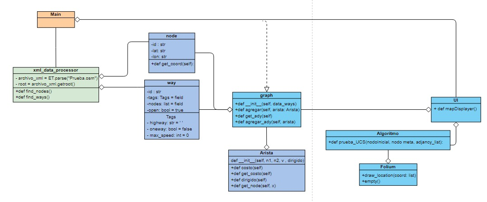

# Open Street Map

## Arquitectura del Proyecto

En este proyecto utilizamos la programación orientada a objetos, en la cual dividimos el sistema en diferentes clases con sus atributos y métodos correspondientes. 

Contamos con un archivo main, a partir del cual se realizará la ejecución. Este llama la clase que procesa el archivo osm. El archivo main será quien llame a la clase Graph y también será quien ejecute la interfaz gráfica. 

La clase que procesa el xml tiene conexión con la clase node, la cual representa los nodos y con la clase way, la cual representa las vías.

La clase Graph además de tener conexión con las clases node y way respectivamente también tiene conexión con las aristas que se va a armar el grafo.

En la UI  se recibirán los datos de entrada  y a su vez este es quien llamará al algoritmo de búsqueda. 

Cuando el algoritmo se termina de procesar, se llamará al método de Folium que se encargará de trazar la ruta del mapa para ser mostrada en la interfaz gráfica.

## Diagrama de Procesos

## Project Architecture

In this project, we used object-oriented programming, where we divided the system into different classes with their corresponding attributes and methods.

We have a main file from which the execution will be carried out. This file calls the class that processes the OSM file. The main file is also responsible for calling the Graph class and for executing the graphical interface.

The class that processes the XML file is connected to the Node class, which represents the nodes, and to the Way class, which represents the ways.

The Graph class, in addition to being connected to the Node and Way classes, is also connected to the edges that will build the graph.

In the UI, the input data will be received, and it will also call the search algorithm.

When the algorithm finishes processing, the Folium method will be called, which will trace the route on the map to be displayed in the graphical interface.

## Process Diagram

